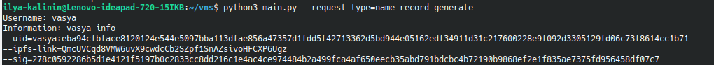
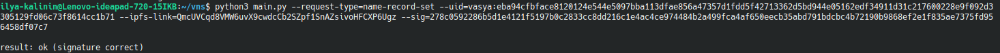
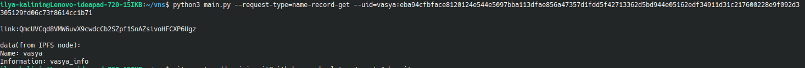

# Назначение

В данном репозитории хранится четвертое задание
по дицсиплине Разработчик криптографических протоколов
и децентраоизованных систем

# Описание

Программа VNS (Vasya Name Service) реализует name-сервис для создания профилей пользователей в IPFS. Это сервис, в котором “именем” является комбинация “user_name + user_public_key”, а ответом на запрос по имени является IPFS-линк на данные о пользователе. При этом, user, владеющий секретным ключом от public key может обновить IPFS ссылку на свой профиль, отправив в сервис запрос на обновление, подписав новую ссылку своим секретным ключом. 

Аргументы командной строки:
Поддерживаемые режимы работы программы:

--request-type=name-record-generate - режим генерации файла, публичного и приватного ключей пользователя, ipfs-link, ее подписи

--request-type=name-record-set - режим добавления/обновления name-record для пользователя

--request-type=name-record-get - режим запроса ipfs-link по пользователю

# Использование

1. Клонируйте данный репозиторий на свою машину.

2. Запустить ipfs-ноду с помощью $ipfs daemon (Подробнее https://dist.ipfs.io/#go-ipfs)

3. Режимы работы:
   1. python3 vns.py --request-type=name-record-generate - запуск в режиме генерации.
   2. python3 vns.py --request-type=name-record-set --uid=<user_id:pubkey> --ipfs-link=<user_ipfs_link> --sig=<user_ipfs_link_signature> - запуск в режиме добавления или обновления.
   3. python3 vns.py --request-type=name-record-get --uid=<user_id:pubkey> - запуск в режиме запроса

## Примечания к запуску

Программа расчитана на работу с несколькими пользователями, данные в режиме запроса отображаются из IPFS. При работе с ipfshttpclient следует использовать новейшую версию.

# Примеры работы программы

​

​

​

    
# Авторы и права на использование

Автор: Калинин Илья

Файлы, содержащиеся в данном репозитории, являются общественным достоянием
и могут использоваться, модифицироваться и распространяться без ограничений.

# Связь

Замечания можно присылать на адрес <kalinin.abs@gmail.com> или в telegram @mozabs
